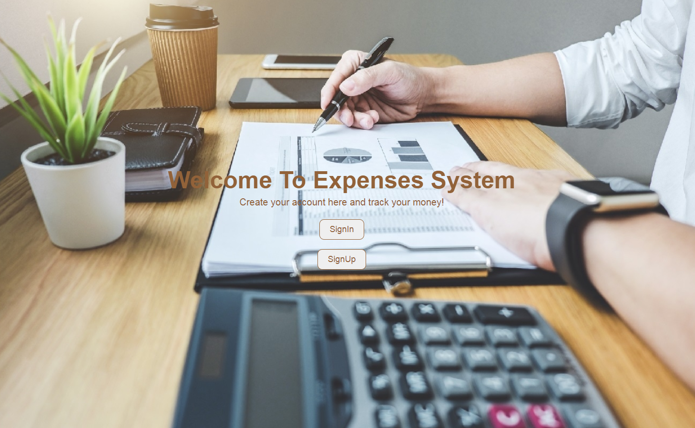

# CostManagementSystem
## Overview
Cost Management System is a web application that helps you to track your money. You can add incomes and expenses and check your balance.
You can help different group targets for example("money for rent" or "money for internet" groups and these groups are created by your roommate).



## Instalation
1. The First step is to clone this repo on your pc
```git clone https://github.com/peterP1998/CostManagementSystem.git ```
2. The Second step is to install mysql on your pc
3. Then execute db.sql file to create the database
4. To run the application you should type go run main.go. The server will run on port 8090

## Features 
This application has two types of users(admin and regular). The admin user can create groups and users,and can delete other users as well.
Regular user can create expenses(for example 10$ for pizza) and create new incomes(for exmaple 100$ from your parents for your birthday).
Another feature of regular user is group donation,you can choose how much you want to donate for the group target.Other features are 
expense history and income history. The last one is balance,in this page you can check your balance(for example if you spent 10$ for pizza and you received 100$ from your parents,your balance should be 90$).Also in this page you can see two graphics. Each one of these graphics are pie charts. For expenses this graphic visualize your expenses by category. For incomes this graphic is similar.

## Final words
This project was created for Golang course in FMI 2021.